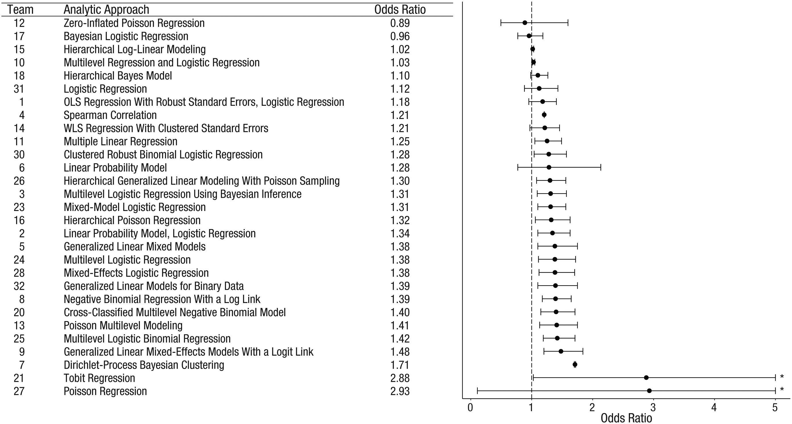

Complex statistical analysis and mathematical modelling involve multitudes of
choices and assumptions. Recent _"many analysts, one data set"_ studies show the 
danger of relying solely on one research team. 

Here we present several examples from this literature. 

  

## [Silberzahn et al. (2018)](https://journals.sagepub.com/doi/abs/10.1177/2515245917747646) --- social science, psychology

> Twenty-nine teams involving 61 analysts used the same data set to address the same
research question: whether soccer referees are more likely to give red cards to 
dark-skin-toned players than to light-skin-toned players. ...Twenty teams (69%) found a
statistically significant positive effect, and 9 teams (31%) did not observe a significant
relationship. Overall, the 29 different analyses used 21 unique combinations of covariates. 
_...significant variation in the results of analyses of complex data may be difficult
to avoid, even by experts with honest intentions._

>The observed results from analyzing a complex data set 
can be highly contingent on justifiable, but subjective, 
analytic decisions. Uncertainty in interpreting research 
results is therefore not just a function of statistical power 
or the use of questionable research practices; it is also 
a function of the many reasonable decisions that 
researchers must make in order to conduct the research.

  

## [Huntington-Klein et al. (2021)](https://onlinelibrary.wiley.com/doi/epdf/10.1111/ecin.12992) --- economics

These researchers ask whether two published empirical studies reporting causal 
empirical results replicate when this is attempted by multiple research teams. 

1. Black et al. (2008) Staying in the classroom and out of the maternity ward? 
   The effect of compulsory schooling laws on teenage births. _The Economic Journal_, 
   118(530): 1025--1054. [Link](https://academic.oup.com/ej/article-abstract/118/530/1025/5089485)
2. Fairlie et al. (2011) Is employer-based health insurance a barrier to entrepreneurship?
   _Journal of Health Economics_, 30(1): 146--162. [Link](https://www.rand.org/pubs/working_papers/WR637-1.html)

They recruit 49 published researchers to participate in replication teams. 

After attrition (due to a short completion window), they obtained 7 independent
replications of each study. 

 replication study.")

replication study.")

> Researchers make hundreds of decisions about data collection, preparation, and
analysis in their research. ...We find large differences in data preparation and analysis 
decisions, many of which would not likely be reported in a publication. No two 
replicators reported the same sample size. Statistical significance varied across 
replications, and for one of the studies the effect's sign varied as well. _The
standard deviation of estimates across replications was 3--4 times the mean reported
standard error._

  

## [Breznau et al. (2022)](https://osf.io/preprints/metaarxiv/cd5j9/) --- economics, statistics

These authors pose the question: _does immigration reduce support for 
social policies among the public_?

To answer it, they recruited 162 participants across 73 teams. 

Each team was provided with a database of answers to a 6-question module on the 
role of government in providing different social services, which is part of the
long-running International Social Survey Programme (ISSP). They were also provided
with a wide range of World Bank, OECD, and immigration data. 

 across 73 teams testing the same hypothesis with the same data. AME, point estimate, and Confidence Interval for each team.")

> ...major research steps explain at most 2.6\% of total variance in effect sizes and
10\% of the deviance in subjective conclusions. Expertise, prior beliefs and attitudes
explain even less. _Each generated model was unique, which points to a vast universe
of research design variability normally hidden from view_ in the presentation, consumption, 
and perhaps even creation of scientific results.

  

## Synopsis

These studies have explicit selection criteria to ensure that they recruit only competent 
researchers.  

Prior to studies of this nature, the "degrees of freedom" inherent in empirical 
analysis were not fully appreciated by researchers.  

More than abundance of choice, these studies reveal a vast universe of previously hidden
research-design and analysis-operationalisation variability. 

  

  

