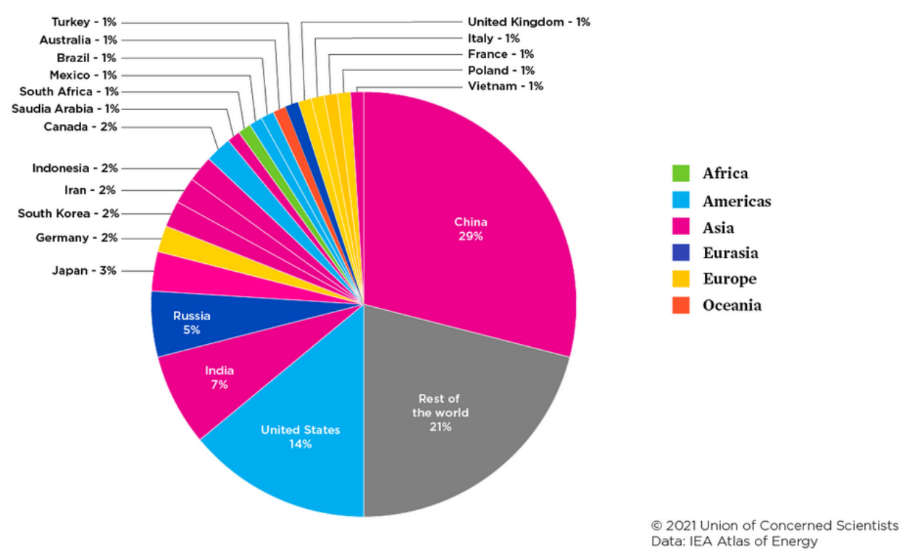

The top 4 emitters -- China, the USA, India, and Russia -- account for 55\% of annual 
CO2 emissions from fossil fuels. These country emissions are antropogenic and exogenous 
to physical-science based climate modelling. 

To develop an undertanding of the anthropogenic contribution to future CO2 concentrations, 
there is a need for _country specialists_ in the politics, energy policies, environmental 
regulations, and economics of each substantial emitter. 

Whereas each successive COP meeting generates easily accessible and centrally collated statements of 
CO2-reduction intent, nations will differ in the extent to which these commitments are monitored 
and enforced. Already at this time, there is [great variability between countries in the probability
of achieving Paris Agreement Goals](https://www.nature.com/articles/s43247-021-00097-8#Fig3). 
These dynamics fall squarely within the social and policy sciences, which currently 
receive only a [tiny fraction](https://www.sciencedirect.com/science/article/pii/S2214629619309119) 
of climate research funding. 

 
