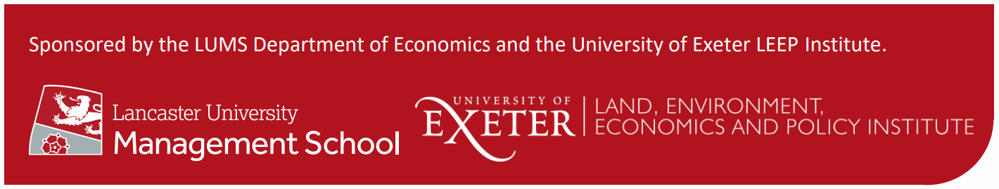

 

# Industry and academic leaders come together for climate risk workshop

An event co-organised by a Lancaster University Management School economist brought industry and academic figures together to discuss the links between investment strategies and climate change.

Dr Kim Kaivanto (Economics) was part of the team behind the Workshop on Prediction Markets for Climate Risk, held at Woburn House, in London.

Researchers and academics with expertise in market mechanisms and climate risk from Lancaster University, Oxford University, the University of Exeter, Imperial College London, the University of Reading and the London School of Economics attended the event online and in-person.

They were joined by representatives of organisations concerned about the accuracy of the climate information they use for decision making, risk management and risk disclosure. These included Aviva, Gallagher Re, Axa XL, BNP Paribas, Premetrica, Economics for the Environment Consultancy, National Bank of Belgium, Weather Logistics Ltd., Global Assoc Risk Professionals, Insight Investment, APG Asset Management, Jupiter Intelligence, Federated Hermes, and Smarkets.

Dr Kaivanto said: “Many planning and investment decisions require an understanding of how future climate change will manifest itself. There are many sources of information and expertise, but decision-makers face significant difficulties in accessing, interpreting, and appraising it.

“This workshop provided the opportunity for academia and finance professionals to discuss how we can establish a UK-based prediction market exchange that will seek to deliver robust and publicly available climate forecasts. It could serve as a mechanism to fund research that targets the highest priority climate risks of sponsoring institutions in an incentive compatible way for providers.”

In his presentation at Woburn House, Dr Kaivanto outlined structural issues with the climate risk information and forecast markets, including how the decadal “discovery times” required to ascertain the accuracy of climate forecasts creates an information asymmetry in which providers are likely to know more about the quality of the forecasts than users. This asymmetry makes the market vulnerable to adverse selection in which low-quality forecasts drive out higher-quality forecasts.

He also discussed the potential risks of relying on single models and providers for climate risk assessment, and the circularity problem in climate prediction, and how it might be solved by allowing forecasters to make predictions of climate conditioned on greenhouse gas concentrations, which is possible using two-dimensional, joint-outcome markets (e.g. CO2 concentration and global temperature anomaly).

The session concluded that participants in prediction markets should be seen as sources of information who are rewarded for impounding their information into prediction market prices, not as sources of revenue for the market maker, or for better-informed or quicker market participants. Selection of participants – potentially restricted to individuals or organisations (academic, private sector or NGOs) – would allow for a diverse and credible pool of expertise, adding to the credibility of the markets.

Participants also concluded that the information the markets would generate would have the attributes of a ‘public good’: non-rival and non-excludable, with funding typically from governments, philanthropic foundations, or consortia of end-users – the latter of whom could limit access to the information, for more of a ‘club good’. 

 

This report on the workshop originally appeared [here](https://www.lancaster.ac.uk/lums/news/industry-and-academic-leaders-come-together-for-climate-risk-workshop). 

 

