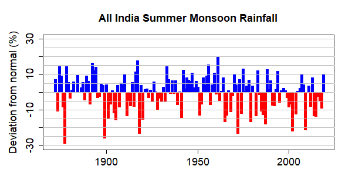
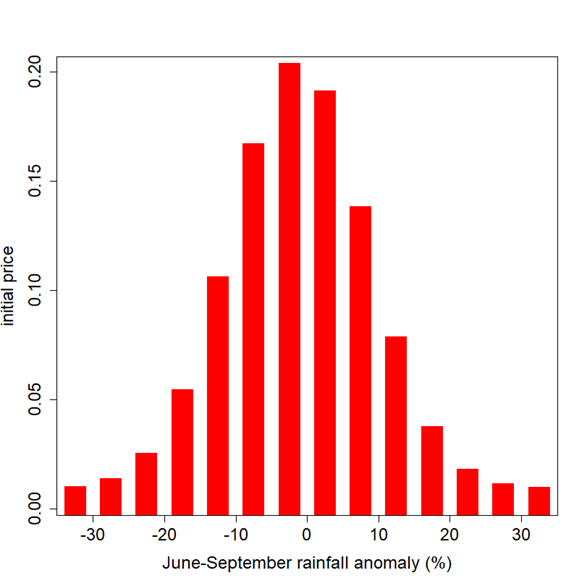

*The annual deviation of the all India summer (June-September) monsoon rainfall (AISMR) from its climatological mean of 880.6mm. The grey lines represent the partitioning for the AIMSR market. Source: [Indian Institute of Tropical Meteorology](https://mol.tropmet.res.in/images//iitm_aismr.txt)*

# Market Specification: 

## Market Overview

| Field | Details |
|---|---|
| **Market** | **OPER: AISMR-YYYY-JJAS**   where YYYY is the calendar year and JJAS refers to the June -- September period.|
| **UNDERLYING** | All India Summer Monsoon Rainfall (cumulative total) between 1st June and 30th September expressed as a percentage above (+) or below (-) the climatological mean of 880.6mm |
| **PREDICTION PERIOD** | June 1 to September 30. |
| **PREDICTION HORIZON** | Initially, the upcoming season, but markets for later seasons could be introduced. | 

## Outcome Space

| Field | Details |
|---|---|
| **Dimensions** | One-dimensional market |
| **Variables** | All India Summer Monsoon Rainfall expressed as a percentage over or under the climatological mean (880.6mm). |
| **Unit** | percentage points (%) |
| **Variable Type** | Continuous |
| **VALUES** |-30% to +30% in intervals of 5% with open-ended intervals at either end.  |
| **NUMBER OF OUTCOMES** | 14 |

## Market Hours

| Field | Details |
|---|---|
| **Opening Date/Time** | 12:00 UTC 18 May 2026 |
| **Closing Date/Time** | 12:00 UTC 30 Sept 2026 |

## Settlement

| Field | Details |
|---|---|
| **Primary Data Source** | Indian Institute of Tropical Meteorology (IITM)   https://mol.tropmet.res.in/images//iitm_aismr.txt    https://www.tropmet.res.in/ |
| **Secondary Data Source** |  |
| **Source Reporting Date/Time** | First publication of the June to September rainfall anomaly from the IITM.  |
| **Settlement Date/Time** | After the market has closed when the IITM or IMD publish the AISMR for the period June to September.  |

## Initialization

| Field | Details |
|---|---|
| **Initialization Type** | Set prices based on historical climatology since 1900, fitted to a normal distribution with a small constant positive offset.  |

---

## Instructions

### Description of Market

This market is to predict the All India Summer Monsoon Rainfall, the cumulative rainfall across India that falls between 1st June and 30th September, as reported by the Indian Institute of Tropical Meteorology. The rainfall is expressed as a percentage above or below the long-run mean of 880.6mm. 

The market will close at 12:00 UTC on 30th September.

### Instructions for Trading

#### Contracts

The *market* is based on individual outcomes. You can place bets and gain credits in the market through the trading of *contracts* — custom bets defined by you. A contract is a collection of *weights* for one or more of the outcomes for the market. Each unit of the contract that you own will pay out a number of credits equal to the weight of the event that occurs.

You can create contracts within the application by clicking on outcomes to select or deselect them, or by dragging to select groups of outcomes at once. Contracts created this way will have a weight of 1 on all selected outcomes and 0 for other outcomes, meaning each unit of these contracts will pay out 1.0 credit if the outcome that the market is settled at is one of the selected ones.

#### Getting Quotes and Trading

Once you have defined a contract you can get a price quote for the quantity you wish to buy. When getting a quote, you either specify the number you want to buy or specify what you want your final holding of that contract to be. You can then choose to trade at the quoted amount, which will create an order for the specified number of contracts.

If you wish to sell contracts you already own you can get a price quote in the same way. The price quoted might not be the price that you trade at, depending on whether other players have placed bets between getting the quote and placing the order. If the price moves against you more than 1% from the quoted amount, your order will be rejected.

#### Shorting

You cannot "short" contracts — that is, sell contracts you haven't previously bought. However, because the outcome space covers all possible outcomes and the prices sum to 1.00, if you believe any outcomes are overpriced it follows that other outcomes must be underpriced. You can take advantage of the mispricing by buying the underpriced outcomes.

  

 

