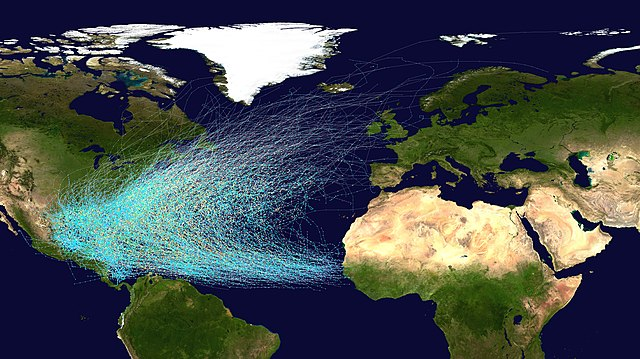

CRUCIAL Atlantic Hurricane Market 2024 (CAHM24) launched on Dec 11, 2023, and will run until the end of the 2024 Atlantic hurricane season. 

This market is to predict the number of Atlantic hurricanes that occur during the 2024 Atlantic hurricane season. Atlantic hurricanes (categories 1 to 5) which occur between June 1 and November 30 2024 will count. The market will be settled in December 2024 using the number of hurricanes as classified by the U.S. National Hurricane Centre.

<iframe src="https://docs.google.com/spreadsheets/d/e/2PACX-1vRjUEwUdYPsURx5vZQyT8eMDJ1i7ZPEL5ce3JwbDYicLPlGHK9nPmCKDg_HAFpCtHIZ5pbzE4lTVAxV/pubhtml?gid=0&amp;single=true&amp;widget=true&amp;headers=false"frameborder="0" width="305" height="520" allowfullscreen="true" mozallowfullscreen="true" webkitallowfullscreen="true"></iframe>

See: [The latest CAHM24 bulletin](/post/cahm24-bulletin-15-01/) 

See: [All CAHM24 bulletins](/tag/cahm24)

  

Image: Atlantic hurricane tracks 1851-2019. Source: [Wikimedia Commons](https://en.wikipedia.org/wiki/File:Atlantic_hurricane_tracks.jpg).

  

