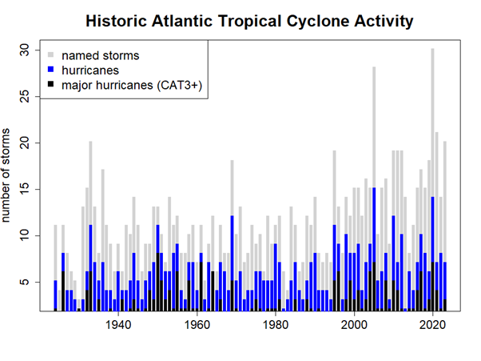
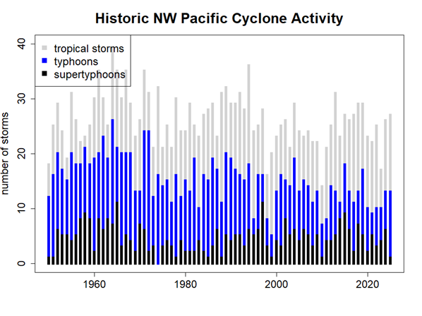
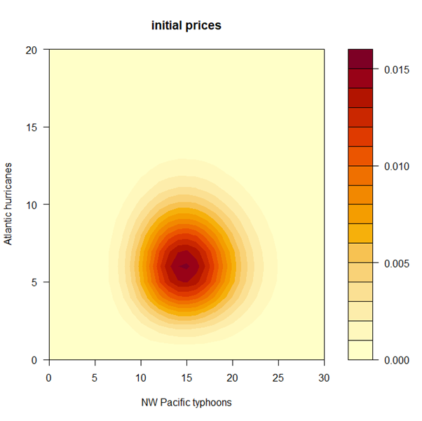

# Market Specification: 

## Market Overview

| Field | Details |
|---|---|
| **Market** | **OPER: CYCLONES-HURR-TYPH-YYYY**   where YYYY is the calendar year.|
| **UNDERLYING** | Number of Atlantic hurricanes and the number of NW Pacific typhoons. |
| **PREDICTION PERIOD** | May 1 to December 31 (n.b. This is longer than the conventional Atlantic hurricane season from June to November used in previous markets). |
| **PREDICTION HORIZON** | Up to 12 months ahead, unless otherwise specified. | 

## Outcome Space

| Field | Details |
|---|---|
| **Dimensions** | Two-dimensional market |
| **Variables** | 1. Number of Atlantic hurricanes   2. Number of NW Pacific typhoons |
| **Unit** | n/a |
| **Variable Type** | Categorical |
| **VALUES** |Hurricanes: 0, 1, 2, 3, 4, 5, 6, 7, 8, 9, 10, 11, 12, 13, 14, 15, 16, 17, 18, 19, 20+   Typhoons: 0, 1, 2, 3, 4, 5, 6, 7, 8, 9, 10, 11, 12, 13, 14, 15, 16, 17, 18, 19, 20, 21, 22, 23, 24, 25, 26, 27, 28, 29, 30+ |
| **NUMBER OF OUTCOMES** | 21 x 31 = 651 |

## Market Hours

| Field | Details |
|---|---|
| **Opening Date/Time** | 12:00 UTC 15 May 2026 |
| **Closing Date/Time** | 12:00 UTC 31 Dec 2026 |

## Settlement

| Field | Details |
|---|---|
| **Primary Data Source** | NOAA National Hurricane Center  https://www.nhc.noaa.gov/   Japan Meteorological Agency   https://www.jma.go.jp/jma/jma-eng/jma-center/rsmc-hp-pub-eg/RSMC_HP.htm  |
| **Secondary Data Source** | World Meteorological Organization: The US NHC is the sole Regional Meteorological Specialized Center (RMSC) for Atlantic hurricanes while the Japan Meteorological Agency hosts the RMSC for Pacific typhoons. If either RMSC cannot fulfil these roles it would fall on the WMO to designate an alternative RMSC. |
| **Source Reporting Date/Time** | First week of January (i.e. any reclassification of storms after this date will not count in the settlement of the market). |
| **Settlement Date/Time** | January of the following year |

## Initialization

| Field | Details |
|---|---|
| **Initialization Type** | Prior modelled using historical data. Historic Atlantic hurricane counts and Pacific typhoon counts are negatively correlated but this correlation will not be incorporated into the initial prices. The initial prices will be the product of two poisson distributions fitted to the hurricane and typhoon counts respectively. |

---

## Instructions

### Description of Market

This market is to jointly predict the number of hurricanes that will occur in the Atlantic and the number of typhoons that will occur in the Northwest Pacific between May 1 and December 31 of the designated year (NB: This is longer than the conventional Atlantic hurricane season from June to November used in previous markets).

The market will be settled in January using the number of hurricanes as determined by the U.S. National Hurricane Center (NHC) and the number of NW Pacific typhoons as determined by the Japanese Meteorological Agency (JMA). The NW Pacific covers the area north of the equator and between 100 deg. E and 180 deg. E.

Note 1: Hurricanes and typhoons that occur after December 31 will not count towards the total for market settlement UNLESS the cyclone was already a named storm on or before December 31.

Note 2: If the number of hurricanes for the season is not available from NHC, or the number of typhoons is not available from JMA then the number as determined by the World Meteorological Organization or its designated Regional Meteorological Specialized Center will be used to settle the market.

### Instructions for Trading

#### Contracts

The *market* is based on individual outcomes. You can place bets and gain credits in the market through the trading of *contracts* — custom bets defined by you. A contract is a collection of *weights* for one or more of the outcomes for the market. Each unit of the contract that you own will pay out a number of credits equal to the weight of the event that occurs.

You can create contracts within the application by clicking on outcomes to select or deselect them, or by dragging to select groups of outcomes at once. Contracts created this way will have a weight of 1 on all selected outcomes and 0 for other outcomes, meaning each unit of these contracts will pay out 1.0 credit if the outcome that the market is settled at is one of the selected ones.

#### Getting Quotes and Trading

Once you have defined a contract you can get a price quote for the quantity you wish to buy. When getting a quote, you either specify the number you want to buy or specify what you want your final holding of that contract to be. You can then choose to trade at the quoted amount, which will create an order for the specified number of contracts.

If you wish to sell contracts you already own you can get a price quote in the same way. The price quoted might not be the price that you trade at, depending on whether other players have placed bets between getting the quote and placing the order. If the price moves against you more than 1% from the quoted amount, your order will be rejected.

#### Shorting

You cannot "short" contracts — that is, sell contracts you haven't previously bought. However, because the outcome space covers all possible outcomes and the prices sum to 1.00, if you believe any outcomes are overpriced it follows that other outcomes must be underpriced. You can take advantage of the mispricing by buying the underpriced outcomes.

  

 

