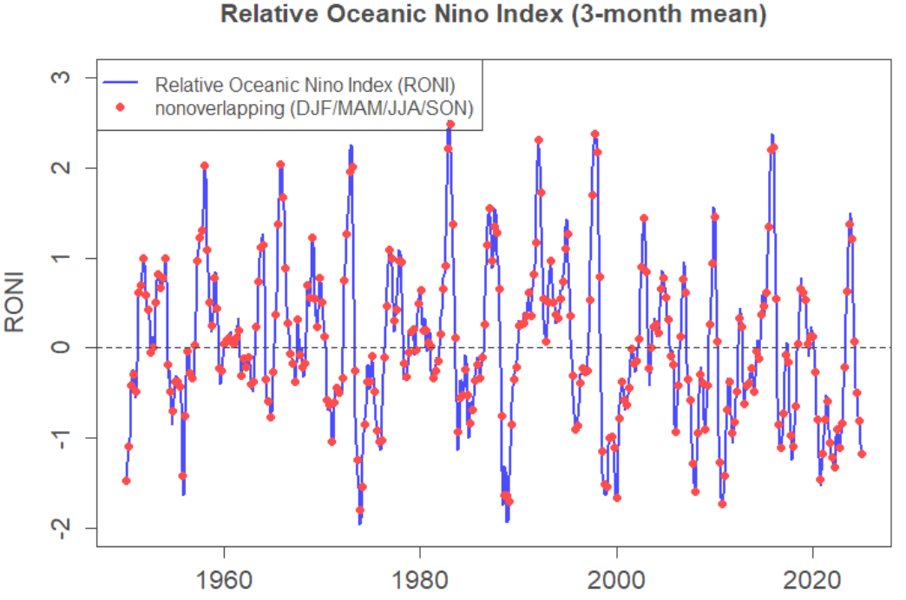

El Niño-Southern Oscillation (ENSO) is an interannual oscillation in tropical Pacific sea surface temperatures and the strength of the tropical zonal atmospheric circulation. The oscillation is irregular with a period between 3 and 7 years. During El Niño events the eastern tropical Pacific becomes warmer while during the opposite phase of the oscillation — La Niña events — the eastern Pacific is cooler than normal.  

ENSO is the single largest source of interannual climate variability and has an impact on weather patterns around the globe through “teleconnections”. El Niño events are associated with a weaker South Asian monsoon, an increase in extreme rainfall events in the Arabian Peninsula, drought in Australia, and fewer Atlantic hurricanes. 

ENSO forecasts are made using a variety of models, both statistical models that are fitted using historical data and dynamical models that simulate the coupled ocean-atmosphere system. While these models show skill on horizons of several months there it is observed that predicting the state of ENSO beyond spring in the northern hemisphere is challenging. This phenomenon is known as the “spring predictability barrier”.   

Due to its effects on so many climate-related risks on seasonal to interannual horizons, and the diversity of approaches used to model and forecast it, ENSO is a good candidate for a CRUCIAL prediction market. 

There are several indices that summarize the state of ENSO, such as the Southern Oscillation Index (SOI) — the normalized difference in sea level pressure between Tahiti and Darwin — and the NINO3.4 SST anomaly — the deviation of the average sea surface temperature in the mid tropical Pacific from its average value for the time of year. 

The proposed index for the market is the Relative Oceanic Niño Index (L’Heureux et al. 2024). The RONI is less sensitive to climate change, and decadal variations, than the standard NINO3.4 SST anomaly on which it is based. 

As well as hopefully providing valuable information in its own right, the ENSO market will also be an example of using prediction markets to produce probabilistic forecasts of a continuous index. This approach could be applied to other climate phenomena that can be summarized as indices, such as the North Atlantic Ocean and the Indian Ocean Dipole.   

**References** 

L'Heureux, Michelle L., et al. (2024) "A relative sea surface temperature index for classifying ENSO events in a changing climate." *Journal of Climate*, 37(4): 1197--1211. [https://doi.org/10.1175/JCLI-D-23-0406.1](https://doi.org/10.1175/JCLI-D-23-0406.1)

# Market Specification: El Niño–Southern Oscillation (RONI)

## Market Overview

| Field | Details |
|---|---|
| **Market** | **OPER: RONI-###-YYYYMMM** (e.g. RONI-001-2025JJA). YYYY is the middle month of the period. The 3-digit number ensures chronological ordering when listed alphabetically. |
| **Strip of Markets** | RONI-001-2025JJA  RONI-002-2025SON  RONI-003-2026DJF  RONI-004-2026MAM  RONI-005-2026JJA  RONI-006-2026SON |
| **Underlying** | Relative Oceanic Niño Index |
| **Prediction Period** | 3-month means for DJF, MAM, JJA, and SON |
| **Prediction Horizon** | Up to 18 months (6 markets) ahead |

## Outcome Space

| Field | Details |
|---|---|
| **Dimensions** | One-dimensional (univariate) market |
| **Variable** | Relative Oceanic Niño Index |
| **Unit** | Degrees Celsius |
| **Variable Type** | Continuous |
| **Minimum Value** | < −3 (open ended) |
| **Maximum Value** | ≥ +3 (open ended) |
| **Size of Interval** | 0.2 |
| **Number of Intervals** | 32 |

## Market Hours

| Field | Details |
|---|---|
| **Opening Date/Time** | TBD |
| **Closing Date/Time** | TBD |

## Settlement

| Field | Details |
|---|---|
| **Primary Data Source** | NOAA National Centers for Environmental Prediction https://www.cpc.ncep.noaa.gov/data/indices/RONI.ascii.txt |
| **Secondary Data Source** | Hadley Centre Sea Ice and Sea Surface Temperature (HadISST) https://www.metoffice.gov.uk/hadobs/hadisst/ |
| **Source Reporting Date/Time** | Last working day of the month following the last month of the averaging period |
| **Settlement Date/Time** | Last working day of the month following the last month of the averaging period |

## Initialization

| Field | Details |
|---|---|
| **Initialization Type** | Prior modelled using historical data |
| **Initial Prices** | A normal distribution with zero mean and a standard deviation of 0.85 |

---

## Instructions

### Description of Market

This market is to predict a three-month average of the Relative Oceanic Niño Index (RONI) as published by NOAA. This is an indicator of the state of El Niño–Southern Oscillation (ENSO), and is published here: 

https://www.cpc.ncep.noaa.gov/data/indices/RONI.ascii.txt

The averaging period for this market is June, July and August 2025. The market will be settled with the number published in the month following the three-month averaging period designated in the name of the market.

> **Note:** If NOAA ceases to publish RONI, an alternative source will be selected (e.g. calculating it from the U.K. Met Office's HadISST dataset). This may delay the settlement of the market.

### Instructions for Trading

#### Contracts

The *market* is based on individual outcomes. You can place bets and gain credits in the market through the trading of *contracts* — custom bets defined by you. A contract is a collection of *weights* for one or more of the outcomes for the market. Each unit of the contract that you own will pay out a number of credits equal to the weight of the event that occurs.

You can create contracts within the application by clicking on outcomes to select or deselect them, or by dragging to select groups of outcomes at once. Contracts created this way will have a weight of 1 on all selected outcomes and 0 for other outcomes, meaning each unit of these contracts will pay out 1.0 credit if the outcome that the market is settled at is one of the selected ones.

#### Getting Quotes and Trading

Once you have defined a contract you can get a price quote for the quantity you wish to buy. When getting a quote, you either specify the number you want to buy or specify what you want your final holding of that contract to be. You can then choose to trade at the quoted amount, which will create an order for the specified number of contracts.

If you wish to sell contracts you already own you can get a price quote in the same way. The price quoted might not be the price that you trade at, depending on whether other players have placed bets between getting the quote and placing the order. If the price moves against you more than 1% from the quoted amount, your order will be rejected.

#### Shorting

You cannot "short" contracts — that is, sell contracts you haven't previously bought. However, because the outcome space covers all possible outcomes and the prices sum to 1.00, if you believe any outcomes are overpriced it follows that other outcomes must be underpriced. You can take advantage of the mispricing by buying the underpriced outcomes.

  

 

