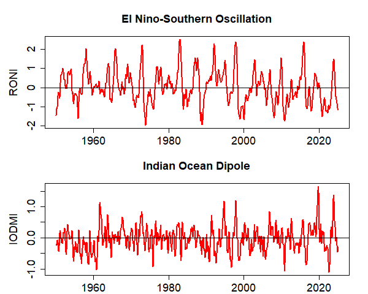
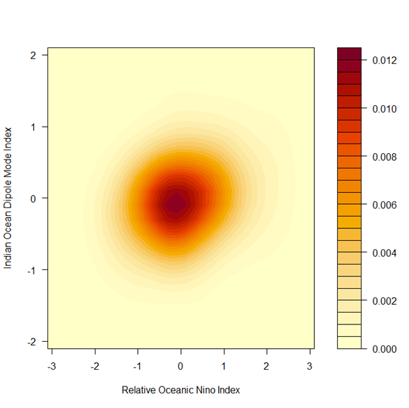

*Rolling 3-month averages of indices for El Niño-Southern Oscillation (Relative Oceanic Niño Index, RONI) and the Indian Ocean Dipole (Indian Ocean Dipole Mode Index, IODMI). [Source: [NOAA National Centers for Environmental Prediction](https://www.cpc.ncep.noaa.gov/data/indices/RONI.ascii.txt). The [Australian Bureau of Meteorology](https://www.bom.gov.au/climate/enso/indices.shtml) also publishes weekly versions of these indices.]*

# Market Specification: 

## Market Overview

| Field | Details |
|---|---|
| **Market** | **OPER: RONI-IODMI-XXX-YYYY-MMM**   where YYYY is the calendar year, MMM is the three-month interval, and XXX is the sequential index of the YYYY-MMM RONI-IODMI market.|
| **Strip of Markets** | RONI-IODMI-001-2026-SON   RONI-IODMI-002-2027-DJF   RONI-IODMI-003-2027-MAM   RONI-IODMI-004-2027-JJA |
| **UNDERLYING** | Relative Oceanic Nino Index (RONI) and Indian Ocean Dipole Mode Index (IODMI). |
| **PREDICTION PERIOD** | 3-month averages: DJF, MAM, JJA, SON. |
| **PREDICTION HORIZON** | Initially, the upcoming season, but markets for later seasons could be introduced. | 

## Outcome Space

| Field | Details |
|---|---|
| **Dimensions** | Two-dimensional market |
| **Variables** | 1. Relative Oceanic Nino Index (RONI)   2. Indian Ocean Dipole Mode Index (IODMI) |
| **Unit** | n/a |
| **Variable Type** | Continuous |
| **VALUES** | RONI: -3 to +3 in intervals of 0.2 with open intervals on either end (32 intervals)   IODMI: -2 to +3 in intervals of 0.2 with open intervals on either end (22 intervals)
 |
| **NUMBER OF OUTCOMES** | 22 x 32 = 704 |

## Market Hours

| Field | Details |
|---|---|
| **Opening Date/Time** | May 2026 |
| **Closing Date/Time** | end of relevant 3-month period |

## Settlement

| Field | Details |
|---|---|
| **Primary Data Source** | RONI: NOAA   https://www.cpc.ncep.noaa.gov/data/indices/RONI.ascii.txt   IODMI: NOAA   https://www.cpc.ncep.noaa.gov/products/international/ocean_monitoring/IODMI/mnth.ersstv5.clim19912020.dmi_current.txt |
| **Secondary Data Source** | Australian Bureau of Meteorology   https://www.bom.gov.au/climate/enso/   monitors both ENSO and IOD |
| **Source Reporting Date/Time** | Last working day of the month following the last month of the averaging period. |
| **Settlement Date/Time** | Last working day of the month following the last month of the averaging period. |

## Initialization

| Field | Details |
|---|---|
| **Initialization Type** | Set prices based on historical climatology since 1950. |

---

## Instructions

### Description of Market

This market is to jointly predict the Relative Oceanic Nino Index (RONI) and the Indian Ocean Dipole Mode Index (IODMI). These are indicators of the state of El Nino-Southern Oscillation and the Indian Ocean Dipole respectively.

The market is for the value of the RONI averaged over the 3-month period designated in the market's name and the value of the IODMI over the same 3-month period.

The time series of RONI is available at:   https://www.cpc.ncep.noaa.gov/data/indices/RONI.ascii.txt 
while the time series of IODMI is available at:  
https://www.cpc.ncep.noaa.gov/products/international/ocean_monitoring/IODMI/mnth.ersstv5.clim19912020.dmi_current.txt

### Instructions for Trading

#### Contracts

The *market* is based on individual outcomes. You can place bets and gain credits in the market through the trading of *contracts* — custom bets defined by you. A contract is a collection of *weights* for one or more of the outcomes for the market. Each unit of the contract that you own will pay out a number of credits equal to the weight of the event that occurs.

You can create contracts within the application by clicking on outcomes to select or deselect them, or by dragging to select groups of outcomes at once. Contracts created this way will have a weight of 1 on all selected outcomes and 0 for other outcomes, meaning each unit of these contracts will pay out 1.0 credit if the outcome that the market is settled at is one of the selected ones.

#### Getting Quotes and Trading

Once you have defined a contract you can get a price quote for the quantity you wish to buy. When getting a quote, you either specify the number you want to buy or specify what you want your final holding of that contract to be. You can then choose to trade at the quoted amount, which will create an order for the specified number of contracts.

If you wish to sell contracts you already own you can get a price quote in the same way. The price quoted might not be the price that you trade at, depending on whether other players have placed bets between getting the quote and placing the order. If the price moves against you more than 1% from the quoted amount, your order will be rejected.

#### Shorting

You cannot "short" contracts — that is, sell contracts you haven't previously bought. However, because the outcome space covers all possible outcomes and the prices sum to 1.00, if you believe any outcomes are overpriced it follows that other outcomes must be underpriced. You can take advantage of the mispricing by buying the underpriced outcomes.

  

 

