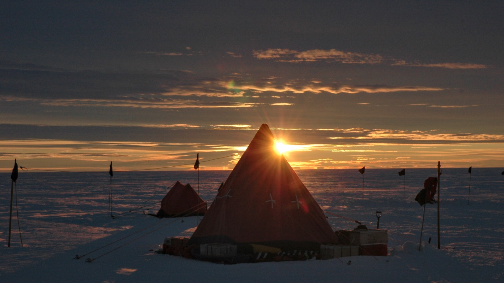
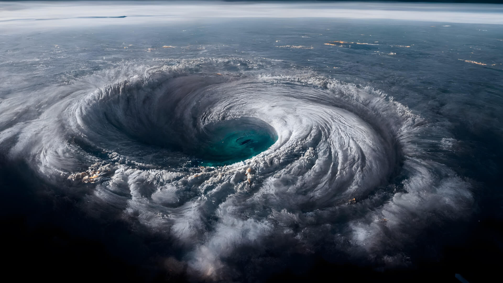
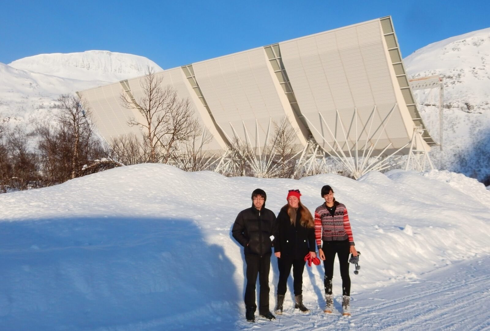
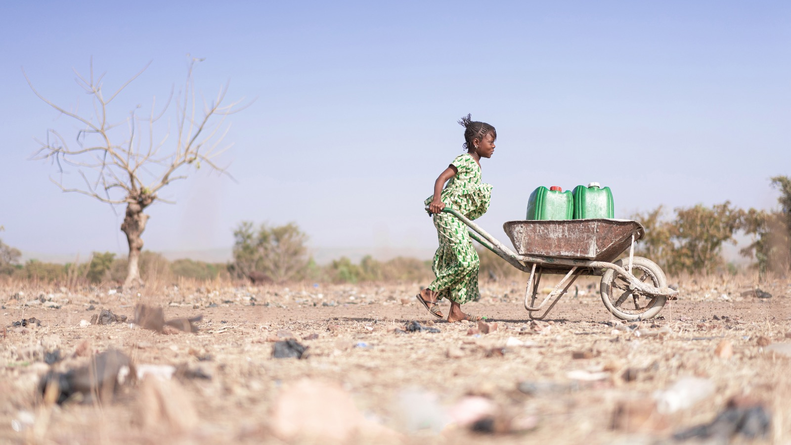
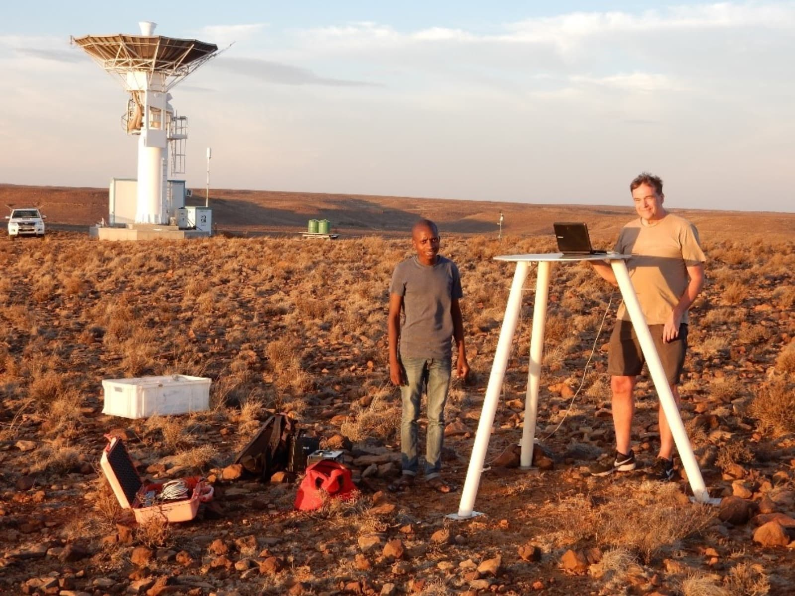

From the perils of icebergs and hurricanes to the power of space weather and the devastation of forest fires, Lancaster University researchers have been working for decades to detect and anticipate shifts in the natural world.

Through techniques such as remote sensors, mathematical skills and data science, our scientists are learning more about changes taking place in some of the most beautiful and remote places on the planet.

From the anticipated to the unexpected, these are changes that are already claiming lives and livelihoods.

Our work at Lancaster aims to enable individuals, communities, businesses, and governments to comprehend and respond to some of these events quickly enough to prevent disaster.

With global average temperatures at 1.56C above pre-industrial levels, the highest on record, predicting our future climate as accurately as possible is more important than ever.

## Vanishing ice

Mal McMillan, Professor in Earth Observation at Lancaster Environment Centre and Co-Director of the Centre of Excellence in Environment Data Science (CEEDS) and Doctor Amber Leeson, Reader in Glaciology and Theme Lead for Environment in the Data Science Institute, are using data science to take vast amounts of information to monitor and model these changes to our planet.

Professor McMillan’s research involves using data from European Satellite Agency (ESA) satellites focussed on the polar ice sheets to understand their contribution to global sea level rise.

He was part of a team that produced the most complete picture of Greenland ice loss to date. The report showed that Greenland was losing ice seven times faster than in the 1990s and is on track to see 40 million more people exposed to coastal flooding by 2100.

Professor McMillan said: “We’re trying to push the boundaries of what we can observe. Over the last ten years, the resolution and detail of the data we get from satellites has dramatically improved.

“Diverse data, capturing the state of ice sheets are now acquired almost continuously so we have vast amounts of data, but the key is how we exploit, model, and extract that information through data science to provide robust scientific evidence.”

From optical imagery to radar data from satellites measuring the elevation of the ice surface or snowfall, Professor McMillan is using data to investigate ice loss and understand the mass of ice sheets and what lies above and below the surface.

He said: “As the frequency and accuracy of measurements improves, we can look more closely at the structure of ice sheets and understand the climate processes around them.

“Radar data and ultra-high-resolution satellite-derived elevation models show lakes buried beneath ice sheets. As we understand more, we also find more that we don’t understand, and very rapid ice loss can often trigger unstable and unpredictable behaviour.”

Doctor Leeson knows this well through her research into the cryosphere (the regions on Earth where water freezes into snow or ice) and specifically how climate change affects the Greenland and Antarctic ice sheets.

Doctor Leeson’s research helps us understand surface processes. By evaluating how rising temperatures impact ice loss and ‘firn’ (partially compacted snow), her research reveals how extreme weather has affected polar regions. The aim is to predict future impacts and what that might mean for the world.

Doctor Leeson said: “Our research is always full of surprises. For example, we knew lakes existed below the ice in Antarctica. This was mapped over 70 years ago. However, our PhD student Jade Bowling discovered new, highly dynamic lakes beneath the Greenland Ice Sheet, one of which exhibited some quite remarkable behaviour.”

Through examining the data, they realised the lake was draining beneath the ice, with the water then forcing its way up to the surface, fracturing the ice sheet as it went.

“This is a new phenomenon. We’ve not seen anything of that scale. We’re now looking at how we develop systems that utilise these high-resolution data to automatically monitor these future events.”

The university’s groundbreaking research has contributed to the Intergovernmental Panel on Climate Change (IPCC) Assessment Reports, the United Nations body that assesses science related to climate change.

Doctor Leeson added: “We’re able to have reasonable confidence in future projections – and their respective uncertainties –up to 2100, but as models get better and their accuracy improves, we hope to improve these predictions and project out even further in time. However, while scientists can provide the evidence, it’s up to people and governments worldwide to decide what they do with that knowledge.”

## Predicting hurricanes

Reacting to climate change and predicting the effects of extreme weather events causing destruction to human life, infrastructure, and the natural environment is the quest of Doctor Kim Kaivanto.

Working with Exeter University as part of the Climate Risk and Uncertainty Collective Intelligence Aggregation Laboratory (CRUCIAL), Doctor Kaivanto has launched the initiative's first prediction market to forecast the number of Atlantic hurricanes.

“Drastically elevated ocean temperatures, driven by climate change, mean that the historical record of hurricanes is no longer a good guide to predict future hurricanes”, said Doctor Kaivanto, Senior Lecturer in the Department of Economics.

“Both land surface and sea surface temperatures have been at record levels for a year, and climate scientists don’t fully understand why. Alternative approaches are clearly needed to predict how many hurricanes will occur each year and how intense they might be – and we believe our new prediction market will help.”

Hurricanes' likely frequency and intensity is valuable information for insurance companies, planners responsible for infrastructure and buildings, and disaster relief planning.

Prediction markets bring together data sets, allowing investors to trade on the likelihood of a specific outcome – in this case, allowing investors to agree on the likelihood of a certain number of hurricanes striking this year.

CRUCIAL' prediction markets bring together diverse teams of experts with differing methodological and modelling approaches, giving them 'skin in the game' to incentivise accuracy. Research teams from diverse disciplines, such as regulation, economics, and political science, combine their efforts in one platform, allowing them to buy mutually agreed contracts on specific outcomes (e.g. the contract that there will be 10 Atlantic hurricanes in 2024). Through teams' trading activity, the prices on these specific outcomes come to reflect the teams' collective expertise and can be formally interpreted as probabilities.

[*Please note that this is an abridged version, passing through several editors before the final version was published to the web, and it differs in certain details from the draft submitted by Kim Kaivanto. Editorial discretion and editorial judgment has prevailed, in keeping with standard practice in journalism.*]

## AI iceberg warnings to keep shipping safe

The commercialisation of projects means research is leading to greater environmental, social, and economic benefits.

For example, Astrophysicist Doctor John Stott is saving lives and money with a project using artificial intelligence (AI) and satellite imagery to detect icebergs.

Working with Dr Matthew Chan, Dr Sonny Bailey, the maritime industry, and other partners, Doctor Stott is developing a precise detection system that can track icebergs and sea ice in shipping routes in any cloud condition with a 94 per cent success rate.

Applying techniques used in astrophysics, the system takes large-area synthetic aperture radar (SAR) satellite images of the ocean and identifies icebergs and sea ice.

The aim is to send the locations of these potential hazards to the shipping industry, including merchant ships, fishing boats and tourist vessels, hoping to avoid incidents involving icebergs.

## Northern lights science sheds light on forest fires

Similarly, Professor Michael Kosch, an experimental space scientist, is applying the methodology used to research the aurora (the northern/southern lights) to detect forest fires, saving millions of tons of CO2 emissions and billions of pounds worth of timber forests.

Professor Kosch said: “The still or video images of the aurora from more than 100km away and the methodology we use is the same process as detecting smoke plumes in forests or wildfires 10-15km away, i.e. fuzzy moving objects in the distance.”

"Deploying this technology in forests means you can detect fire much sooner, usually in less than 8 minutes, which means suppression actions to stop the fire are going to be much more successful."

A spin-out company is working in commercial forests using automatic cameras to view the forest floor and horizon to look for smoke, which is then geolocated to 10m resolution and passed on to foresters.

Professor Kosch added: "Over the last decade, we’ve been able to save billions of pounds in terms of timber not lost and billions of pounds of carbon dioxide (CO2) not emitted. The value of CO2 not emitted is greater than the value of timber saved, which means we’re contributing to the mitigation of climate change."

"Fires can grow exponentially, so this technology means we can cover millions of hectares and ultimately reduce the loss of homesteads and livelihoods while saving lives."

## Using the power of mathematics to predict drought

The university's research supports communities and livelihoods around the world, with Doctor Carolina Euan, Lecturer in Statistics, using the power of mathematics to predict drought in Latin America.

Her research applies data science and statistical methods to process rainfall and solar data for Mexico to understand rainfall and drought patterns and how both are likely to evolve over time.

Doctor Euan said, “The climate of dry and rainy seasons in Mexico is well understood, but rainy seasons are becoming more intensive, and dry periods last longer, and both are becoming unpredictable.

“My research is bringing together spatial data which reveals the impact of rain isn’t necessarily felt where it falls, with droughts that directly impact the South East having a delayed impact in the North. States need to

work together to prepare for climate changes and how this might impact residents, tourism, and agriculture on a national level.”

Dr Euan’s latest project investigates the behaviour of ocean waves and how different waves can predict storms and impact tidal energy production.

## Futureproofing your daily commute from solar storms

Closer to home, a team from Lancaster led by PhD researcher Cameron Patterson and Professor Jim Wild are examining the impact of 'space weather' on railway safety.

They're investigating how the signalling systems on the lines between Preston to Lancaster and Glasgow to Edinburgh can be affected by solar storms switching signals from red to green.

Solar storms can trigger powerful magnetic disturbances on Earth, creating geomagnetically induced currents (GICs) that could potentially interfere with electrified railway lines powered by overhead cables.

Their research found that space weather events capable of triggering faults in track circuits are expected to occur in the UK every few decades.

Professor of Space Physics Jim Wild said, "As our understanding of space weather improves, we can consider how to reduce the risks, and this information will help railways and other industries plan for the future."

 
 

This post is an adaptation of the Lancaster University website piece entitled [Sensing Danger](https://www.lancaster.ac.uk/news/spotlight/sensing-danger/).

 
