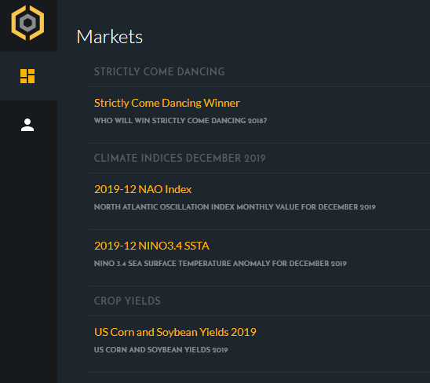
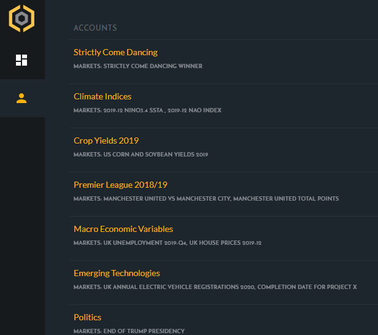
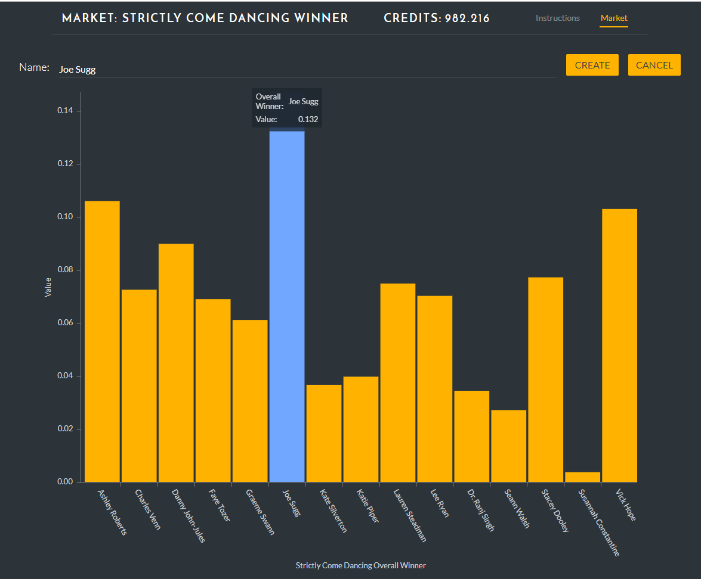
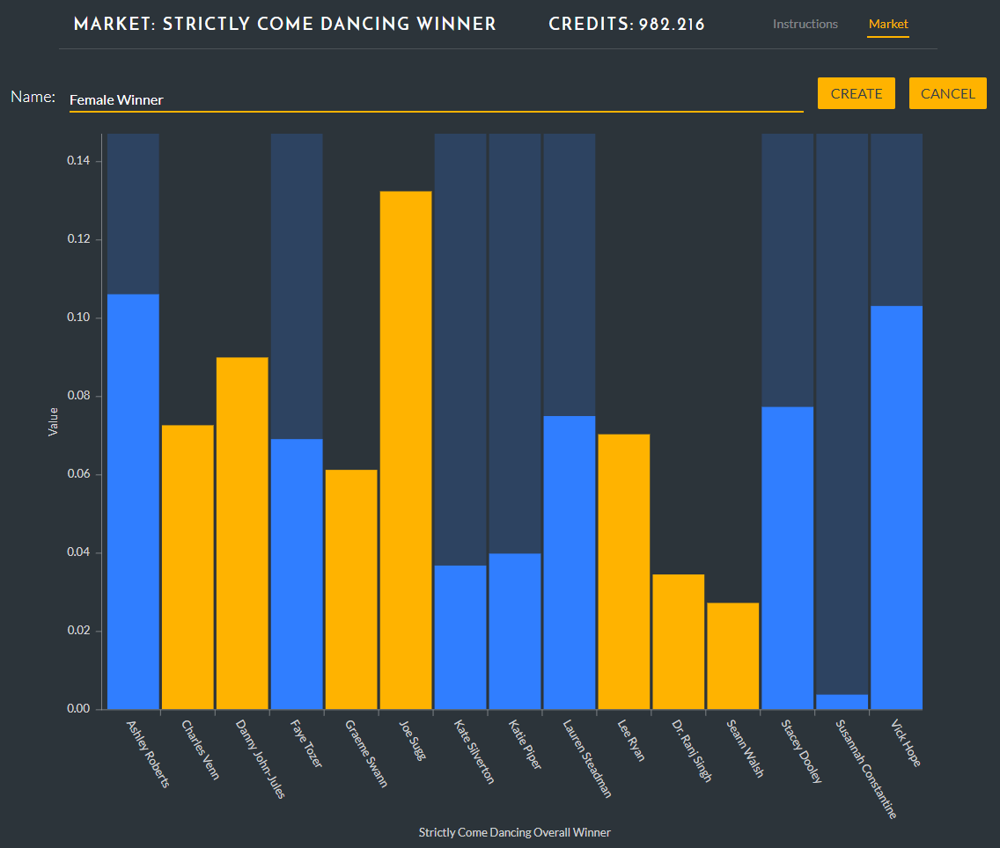
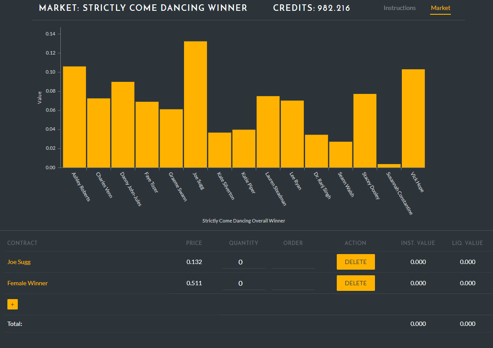
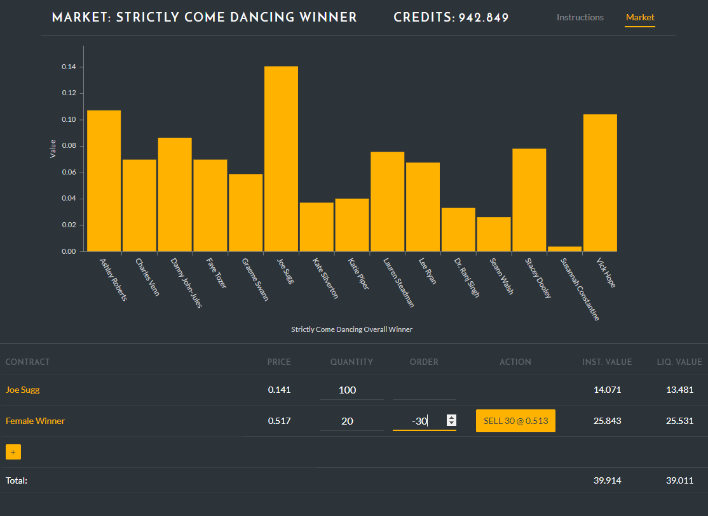
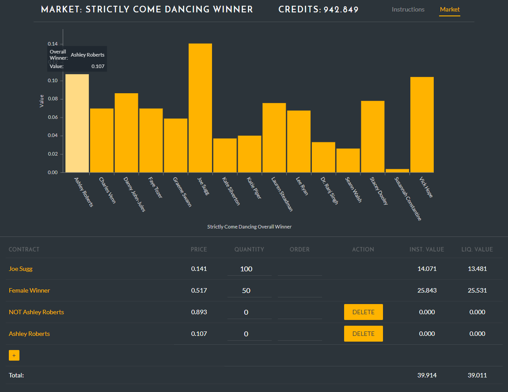
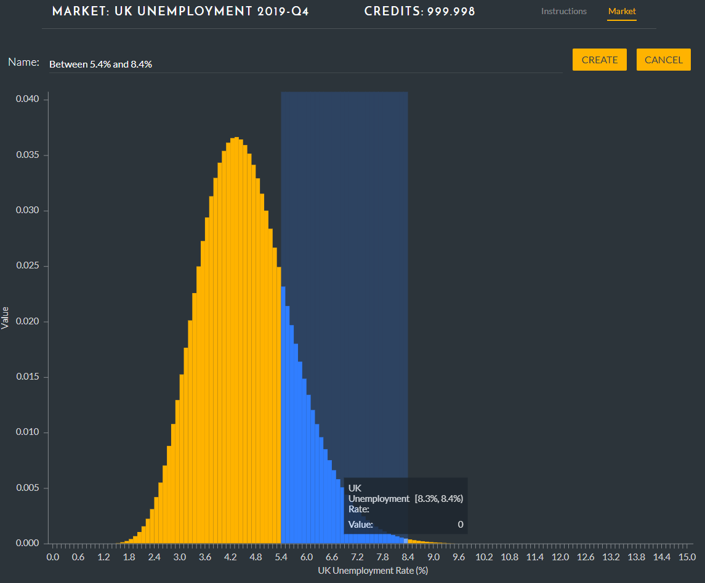
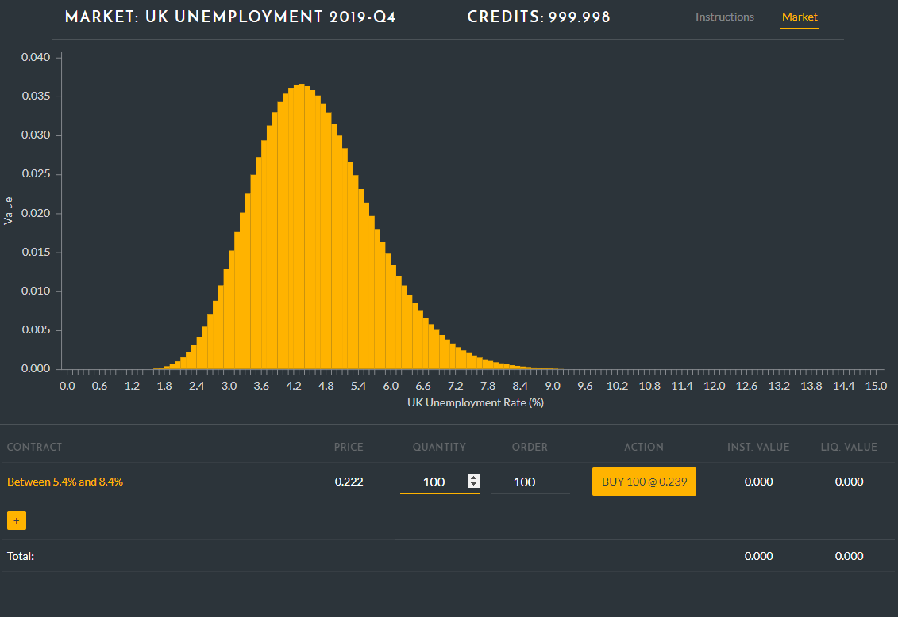

AGORA is a platform for hosting prediction markets in which participants can bet on the outcome of events or the values of particular quantities. This article is an introduction into how to trade prediction markets on AGORA. We will cover the mechanics of how you place trades and also offer some tips on how to translate your judgments and opinions into trading strategies.

If you have been invited to participate in an AGORA market then you can login to the platform and you will see a screen showing a list of the individual markets open to you (your list will be different to the one below).

If you click on the “accounts” icon (the head and shoulders) you will see a list of your accounts with the markets that use that account listed underneath each one. If two markets belong to the same account then credits earned in one market may be used in the other market but credits cannot be transferred from a market under one account to a market under another account.

### Defining Contracts and Placing Trades

To trade, you select the “markets” icon (the four panels) and then select a market, 
e.g. the “Strictly Come Dancing Winner” market. This demonstration market is for 
predicting the winner of the 2018 series of BBC’s _Strictly Come Dancing_ programme 
(Americans will know this programme as _Dancing with the Stars_). In the programme 
15 celebrities compete at dancing with one celebrity being ejected from the competition 
each week. This market is, as the British election commentator Peter Snow might say, 
“just a bit of fun”, but it illustrates many of the key features of AGORA. This market 
has 15 distinct outcomes. In all AGORA markets, outcomes are _Mutually Exclusive and 
Comprehensively Exhaustive_ (MECE): this means that only one outcome can occur but 
one outcome must occur.

")

The figure above is the market screen for the _Strictly_ market. The number of credits you have in this market space is shown at the top. The current prices for each outcome are shown in the bar graph. The favourite is Joe Sugg with a price of 0.132. This price can be interpreted as the probability of Joe Sugg winning. AGORA allows you to define contracts that cover one or more outcomes. You can then buy one or more of the contracts you define. At settlement you will receive 1.00 credit for each contract you hold that covers the outcome that actually occurs.

To define a contract click on the “+” icon, then click on one or more outcomes that you want covered by the contract.

The simplest type of contract covers a single outcome. For example, the figure above shows a contract that covers Joe Sugg winning. AGORA has automatically named this contract “Joe Sugg” but you are free to rename the contract if you want. Contract definitions are specific to you — other participants do not see your contracts and must define their own. If you click “create” the Joe Sugg contract is created.

Contracts can cover more than one outcome. For example, you can create a contract covering all the female contestants and name the contract “Female Winner”.

Your portfolio is shown below the price bar chart. AGORA uses a market maker that will always quote a price for a contract. These prices are shown in the PRICE column. The QUANTITY column shows how many units of each contract you currently hold. To buy contracts you can either specify the number you wish to have in the QUANTITY field or you can specify a change in your inventory in the ORDER field. Although you have defined two contracts you have not yet bought any so you can delete the definitions.

.")

In the figure above, an order to buy 100 of the Joe Sugg contract has been placed and the market maker is quoting a price of 0.138 per contract. This is slightly higher than the 0.132 in the PRICE column because the market maker raises the price a bit in response to the buy order.

 

### Going Long and Going Short

Since a contract pays out 1.00 credit if an outcome covered by the contract occurs it follows that the expected value of the contract is the probability that the outcome occurs. If you think that the probability of a contract paying out is substantially higher than the quoted price then you have a reason to buy the contract, or “go long” in the parlance of financial markets. But, what if you think the quoted price of a contract is significantly higher than the probability of it paying out? In other words, what if you think a contract is overvalued? How can you exploit such a mispricing? The AGORA platform does not allow you to “go short” — sell contracts you don’t already own — which is what speculators do to stocks they think are overpriced. However, the prices of all outcomes always sum to 1.00: if you buy one unit of every outcome it will cost you 1.00 (but you are guaranteed a pay out of 1.00 at settlement). This means that if you think any outcome is overvalued there must be other outcomes that are undervalued.

!(Selling the complementary contract; going short](complementary-contract.png "Figure 9**: If you think Ashley Roberts is overvalued we can define a complementary contract which will be undervalued.")

For example, suppose you think that former Pussycat Doll Ashley Roberts is overvalued — yes she’s good but you think the judges and voting public will be harsher on her due to her previous dancing experience — you can define a contract covering all the other contestants as shown above.

To demonstrate that contracts covering complete sets of outcomes sum to 1.00 you can also define a contract for Ashley Roberts. The prices of these two complementary contracts sum to 1.00. If you think the “Ashley Roberts” contract is overvalued the contract “NOT Ashley Roberts” must be undervalued, so you can express your view by buying this contract.

### Markets for Continuous Quantities

The _Strictly Come Dancing_ market is an example of a market for a categorical variable that can take on one of several distinct values. AGORA also supports markets for continuous variables by partitioning the variable into discrete intervals. To illustrate this lets look at a demonstration market for the UK unemployment rate in the final quarter of 2019.

The Office of National Statistics reports the UK unemployment rate to an accuracy of 
0.1\% so this is a sensible interval for partitioning this variable. Trading individual 
outcomes covering just 0.1\% would be cumbersome but because of the way AGORA lets you 
define contracts you can create contracts covering intervals, including multiple 
disjoint intervals. Note that the individual intervals for unemployment are represented 
as intervals that are “closed” at the lower end and “open” on the upper end. This is 
written as [8.3\%,8.4\%) and means the interval includes 8.3\% but not 8.4\%.

In Bayesian statistics a credible interval is a range in which a variable will fall with a specified subjective probability. Let’s suppose _your_ 90\% credible interval for UK unemployment in Q4 of 2019 is 5.4\% to 8.4\%. You can define a contract covering this interval and get a price quote for it.

In the example above, you are being quoted a price of just 0.222 for this interval. 
If you really think the probability of the true value falling in this range is 90\% 
this contract has an expected value of 0.90 so it’s a very good buy.

### Market Settlement

When a market settles, all contracts covering the correct outcome pay out 1.00 credit 
which is added to your credit balance. All other contracts are worthless. All AGORA 
markets are denominated in credits. 
In markets run by CRUCIAL, these credits represent shares of the segregated research funding pool. 

### Summary 

Hopefully this article will have introduced you to AGORA and enabled you to start trading in markets in which you have been invited to participate. As you become more familiar with AGORA markets you may wish to implement more intricate trading strategies using the API. Trading using the API will be the topic of a future article.

 

This is an updated version of an article which appeared on Medium 11.10.2018 as [A beginner’s guide to trading prediction markets on Hivemind AGORA](https://medium.com/hvmd/a-beginners-guide-to-trading-prediction-markets-on-hivemind-agora-95e0df9c45d7)

 
