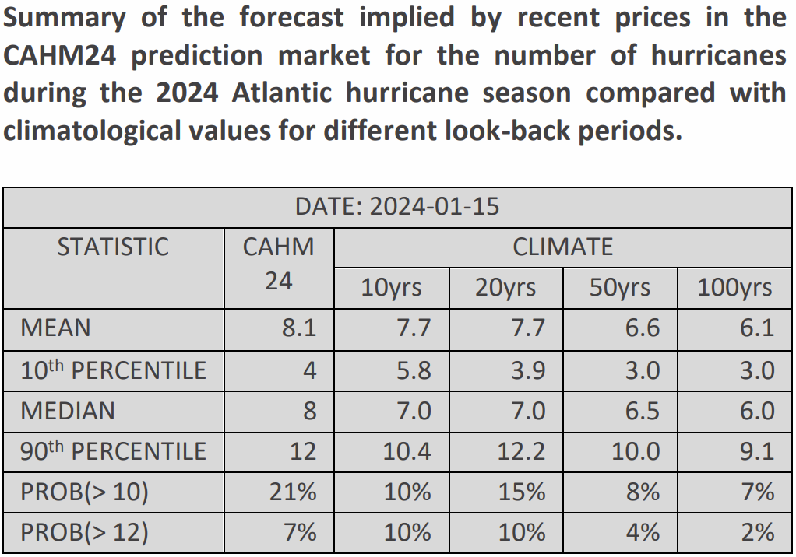

**It’s Groundhog Day, and appropriately the CAHM24 prediction of how many hurricanes there will be this year is unchanged since the last bulletin.**

There have been no significant changes in CAHM24 prices over the past two weeks, reflecting a relative absence of new developments or information. 

**Adam Lea of TSR interviewed by Fox**:

Dr. Adam Lea recently discussed Tropical Storm Risk’s December forecast on Fox News. His view is that warmer than average Atlantic temperatures are likely to persist through this year and these, combined with neutral to La Niña in the Pacific, point to a season that is more active than the historical averages. Prices in CAHM24 imply that the participants in the market broadly agree with this outlook. 

The interview is available to watch on [YouTube](https://www.youtube.com/watch?v=FEh5LGDVcNA). 

<iframe width="560" height="315" src="https://www.youtube.com/embed/FEh5LGDVcNA?si=RQW7M8CDJhd7Hvlj" title="YouTube video player" frameborder="0" allow="accelerometer; autoplay; clipboard-write; encrypted-media; gyroscope; picture-in-picture; web-share" allowfullscreen></iframe>

  

Price updates from CAHM24 will be regularly published at https://www.crucialab.net/market/cahm24/.  

 

 

 
 
