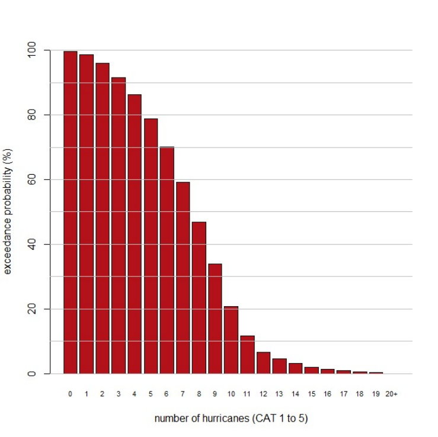
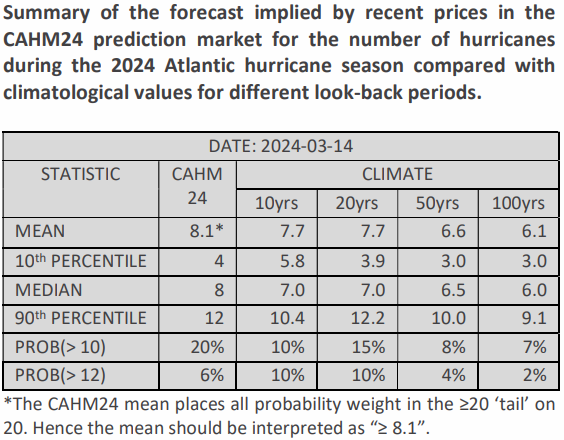

**A new commercial forecast has landed as sea-surface temperatures have been at record levels for 1 year and as El Niño is expected to transition into La Niña by mid-summer.**

As the number of organisations issuing predictions 
of Atlantic hurricane activity increases so does the 
usefulness of CRUCIAL’s prediction market which 
can aggregate disparate forecasts, along with the 
views of its expert participants as to their 
credibility, into a unified probability forecast. 

The reinsurance portal, ARTEMIS, maintains an excellent 
summary page of forecasts for the 2024 hurricane season 
[here](https://www.artemis.bm/2024-atlantic-hurricane-season/). 
As of this month three organisations have issued forecasts. 
Tropical Storm Risk are predicting 9 hurricanes, Weatherbell 
are predicting 14-16 while the European Centre for Medium 
Range Weather Forecasting (ECMWF) are predicting 9 
hurricanes, although their prediction only runs to September 
30 and not the end of the official hurricane season on 
November 30. 

The [Barcelona Supercomputing Centre’s](https://seasonalhurricanepredictions.bsc.es/)
forecast comparisons will become available in April. 

  

Price updates from CAHM24 will be regularly published at https://www.crucialab.net/market/cahm24/.  

 

 

 
 
