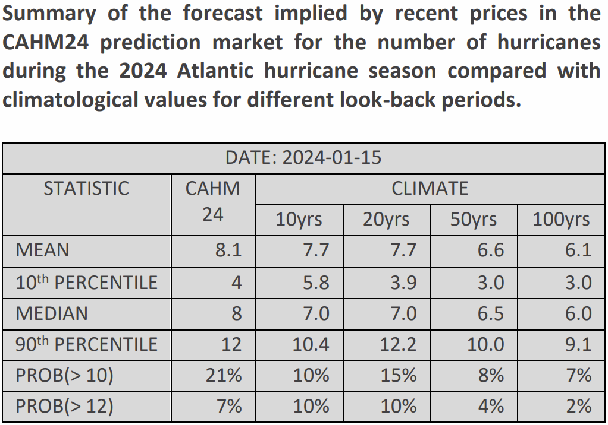

**CRUCIAL's hurricane prediction market is forecasting a higher-than-average number of hurricanes this year.**

In December, WeatherBELL issued a forecast for the "[hurricane season from hell](https://www.weatherbell.com/hurricane-season-from-hell-first-look)", with 14 to 16 hurricanes, but CAHM24 prices imply that few, if any, participants agree with such an extreme outlook at this stage.

**Outlook of a market participant**:
> "This far out from the hurricane season, it is hard to predict more than very general trends and signals. We have done some initial research into drivers of hurricane activity, and used publicly available forecasts for the evolution of these over the coming months. We also assessed trends from climate change. These led us to expect higher-than-average hurricane activity for the 2024 season. We later found that an organisation, Tropical Storm Risk, had released an extended-range forecast for the 2024 season of 9 hurricanes. This broadly agrees with our initial model."

As new forecasts and other information become available to the participants in the prediction market prices will evolve to reflect their updated probabilities. 

Price updates from CAHM24 will be regularly published at https://www.crucialab.net.  

 

 

 
 
