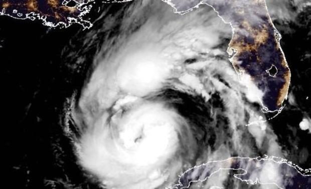

**Hurricane Helene has become the fifth hurricane of 2024 in an usually quiet first half of a season that was predicted to be very active.**

The implied probability, according to prices in the CAHM24 expert prediction market, of more than 10 
hurricanes has dropped since July from 42% to 23%, while the chances of more than 12 hurricanes has 
decreased to from 23% to 8%. 

## Why has the season been so quiet? 

It has been more than half a century since there has been a 
period without hurricanes during August and September as 
long as the one that was brought to end by Helene. One 
possible explanation is a northward shift in the West 
African monsoon which generates tropical waves that can 
disrupt the evolution of tropical storms. This reason 
illustrates why statistical relationships between sea surface 
temperatures and hurricane activity seen in the historical 
record might not persist in a changing climate. 

  

Price updates from CAHM24 will be regularly published at https://www.crucialab.net/market/cahm24/.  

  

 

 
 
