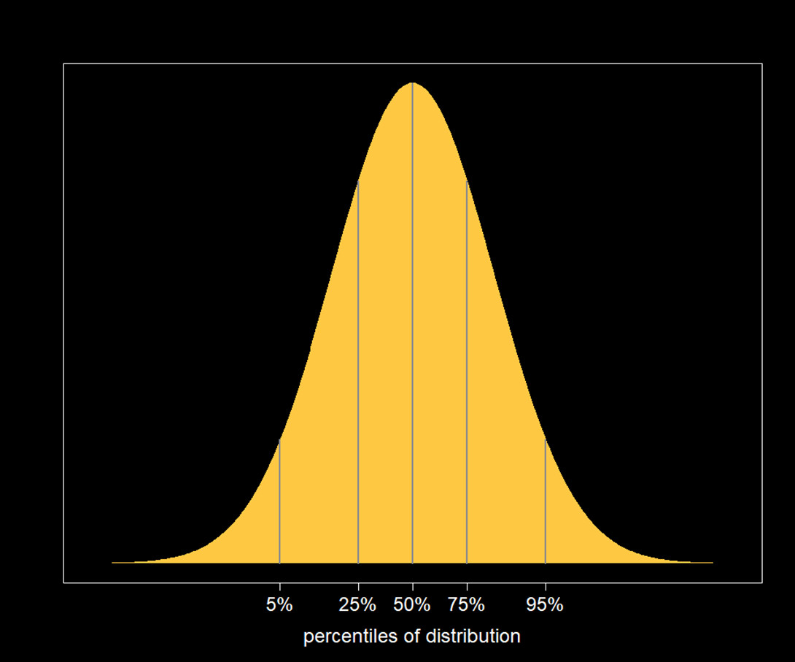
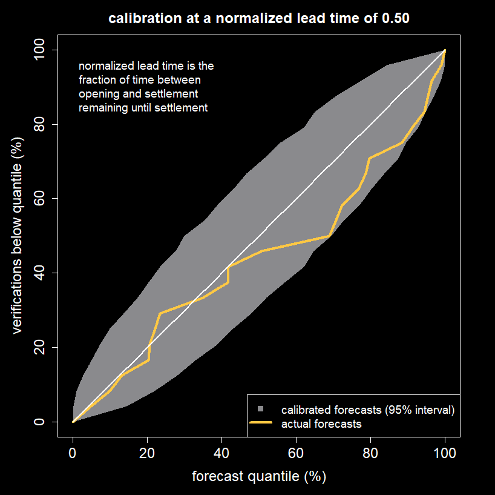
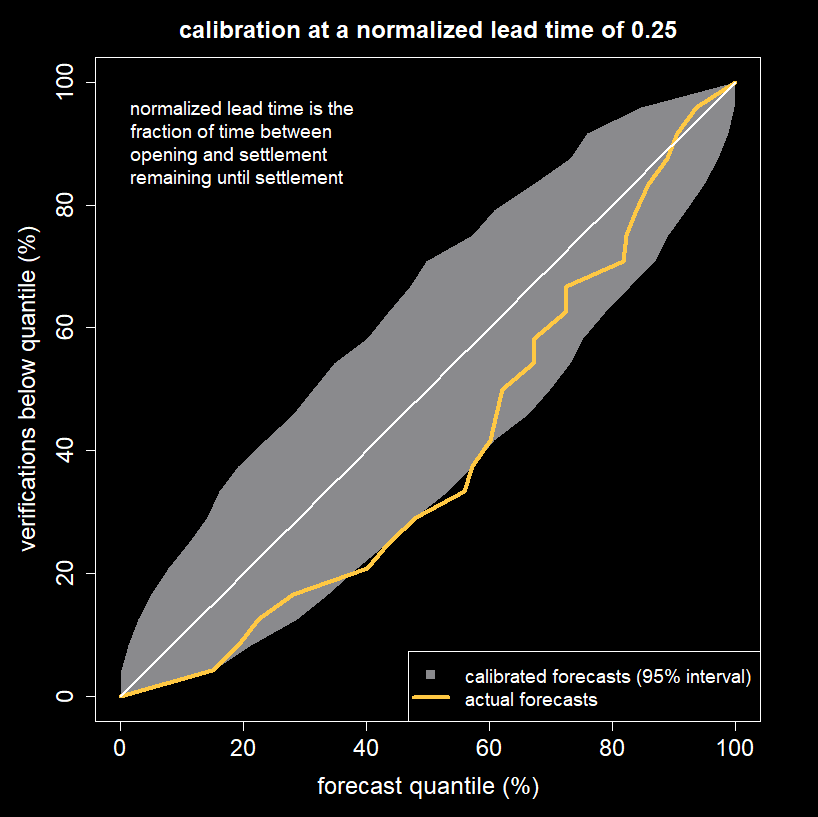

**“Calibration means the frequency of events matches their predicted probabilities”**

There are two desirable characteristics that probability forecasts should have: 
_calibration_ and _sharpness_. Calibration means that the frequency of events matches 
their predicted probabilities while sharpness refers to how often predicted probabilities 
are close to 0\% or 100\% for binary forecasts or how narrow the forecast distribution is 
for a numerical value. Making sharp forecasts is trivial if you don’t care about 
calibration, so in this blog we will investigate whether forecasts produced by AGORA 
are calibrated.

If I predict a 90\% chance of an event occurring and it doesn’t happen then I am not 
wrong because I allowed for a 10\% chance of it not happening. If, however, I repeatedly 
predict a 90\% chance of things occurring and they keep failing to happen you will lose 
confidence in my ability as a forecaster. This is because my forecasts are not well
 calibrated. Calibration means the frequency of events matches their predicted 
 probabilities: for example, if you record all the times I said there was a 60\% 
 chance of something occurring, that something should have happened 60\% of those times.

For well calibrated forecasts of numerical values half the time the actual value 
should fall below the median (50th percentile) of the predicted distribution and 
half the time it should fall above it. Similarly, the actual value should fall 
below the 10th percentile of the predicted distribution in 10 per cent of cases, 
below the 20th percentile in 20 per cent of cases, and so on. These percentiles 
are illustrated in Figure 1. If we plot the percentage of forecasts for which the
actual value falls below a given percentile of the forecast distribution we should 
get a diagonal line. Because we have a finite number of forecasts there will be 
deviations from this line, even if the forecasts are perfectly calibrated, with 
the size of the deviations shrinking as the number of forecasts used in the analysis 
increases.

. The grey envelope shows the amount of deviation from the diagonal that can be expected if the 23 forecasts were perfectly calibrated. The plot is consistent with AGORA forecasts being well calibrated.")

When performing a calibration analysis we need to choose a forecast lead time. If 
all the forecasts in the analysis are of the same type then this is straightforward: 
for example, we might want to check the calibration of rainfall forecasts 3 days 
before the target date. If, however, we are dealing with different types of forecasts, 
choosing a common lead time might not make sense: Harold Wilson said that, “A week 
is a long time in politics”, but a week is no time at all in climate prediction. We 
will express all lead times relative to the duration of the prediction market: A 
normalized lead time of 0.25 means that a quarter of the time between opening and 
settlement remains until settlement.

Figure 2 shows the calibration of 23 AGORA forecasts. The forecasts included in 
the analysis were all the public markets that have been run on the AGORA platform 
with cash incentives for participants. This includes predictions of monthly UK 
temperature, values of an El Niño-Southern Oscillation index and monthly totals 
of COVID-19 cases in the U.S. The yellow line follows the diagonal with some 
deviations but the deviations lie within the grey envelope, which indicates how 
much deviation would occur with 23 perfectly calibrated forecasts.

Figures 3 and 4 show the calibration plot for normalized lead time of 0.50 and 
0.25. The plot for 0.25 suggests the frequency of the actual value falling below 
the median is only about 30\% although this deviation is still consistent with 
calibrated forecasts due to the relatively small number of forecasts in the analysis.

**“AGORA forecasts are consistent with being well calibrated.”**

These results show the AGORA forecasts are consistent with being well calibrated 
so it is not unreasonable to take the probabilities that AGORA produces at face 
value. Prescriptions of how to make rational decisions in the face of uncertainty 
often assume that quantitative probabilities can be assigned to potential outcomes. 
AGORA prediction markets can be used as a source of these probabilities.

 

This article originally appeared on Medium as [How good are AGORA forecasts?](https://medium.com/hvmd/how-good-are-agora-forecasts-8065bf372067)

 
