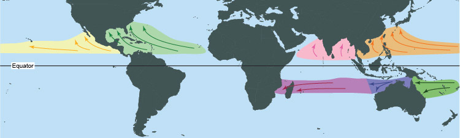

**What is the difference between a tropical cyclone, a hurricane, and a major hurricane?**

A tropical cyclone is a warm-core low pressure system, without any front attached, that develops over the tropical or subtropical waters and has an organized circulation.[^1]

Within 5° latitude of the equator, the *Coriolis force* is insufficient to generate the 'spin' that is characteristic of cyclones. 

Tropical cyclones forming in the North Atlantic Ocean, the Gulf of Mexico, and the Caribbean Sea basin (light-green area in Figure 1) have the potential to be classed as *hurricanes*. 

Whether they are or not depends on the maximum sustained windspeed of the cyclone. If the maximum windspeed, sustained for periods of 1 minute or more, is at least 74 mph, then the tropical cyclone is classed as a 'hurricane'. 

The Saffir-Simpson Hurricane Wind Scale was developed to grade hurricanes by their damage potential.[^2] 

Hurricanes in category 3 and above (sustained windspeeds of 111 mph and above) are classed as *major hurricanes*(*). 

         
**Table 1.** The Saffir-Simpson Hurricane Wind Scale.

| Cat | Windspeed | Impact illustration: effect on trees  |
| :---       | :---       | :---                                  |
| 1 | 74-95 mph  | Large branches of trees will snap; shallow-rooted trees can be toppled. |
| 2 | 96-110 mph | Many shallowly rooted trees will be snapped or uprooted, blocking numerous roads. | 
| 3* | 111-129 mph| Many trees will be snapped or uprooted, blocking numerous roads. |
| 4* | 130-156 mph| Most trees will be snapped or uprooted; power poles downed. Fallen trees and power poles will isolate residential areas.|
| 5* | >156 mph   | Nearly all trees will be snapped or uprooted and power poles downed. Fallen trees and power poles will isolate residential areas. |
||| |

      

                             

<iframe width="560" height="315" src="https://www.youtube.com/embed/W3ghU4e2OKY" title="YouTube video player" frameborder="0" allow="accelerometer; autoplay; clipboard-write; encrypted-media; gyroscope; picture-in-picture; web-share" allowfullscreen></iframe>

 
 

Featured image (dial) credit: https://www.servicemasterrestore.com/blog/weather/tropical-storms-and-hurricanes-what-s-the-difference-/

 

[^1]: Source: https://www.noaa.gov/jetstream/tropical/tropical-cyclone-introduction

[^2]: Source: "Saffir-Simpson Hurricane Wind Scale" explainer published by NOAA. https://www.nhc.noaa.gov/aboutsshws.php

 
 
