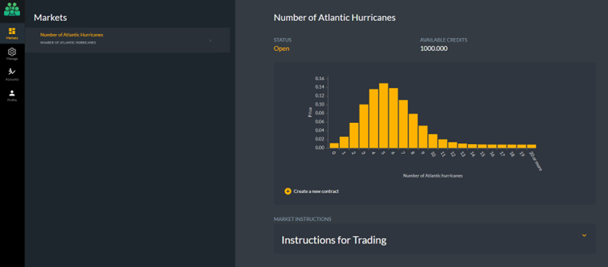
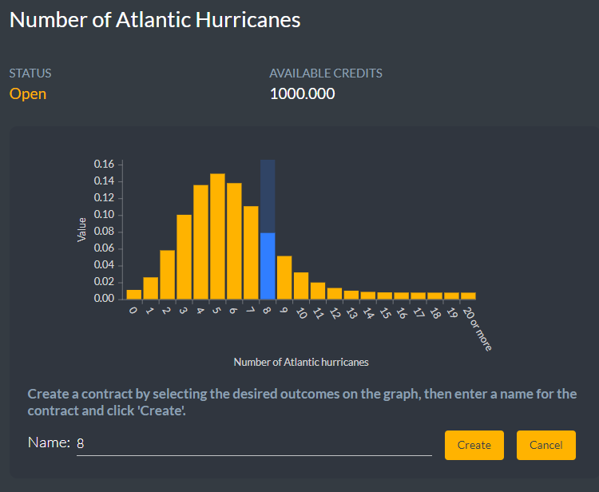
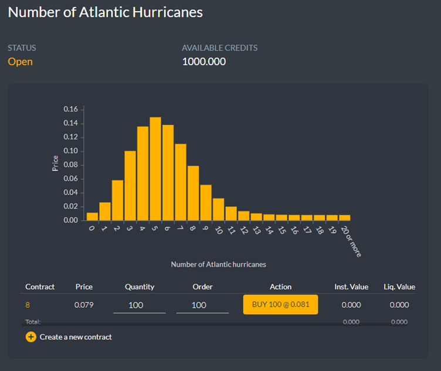
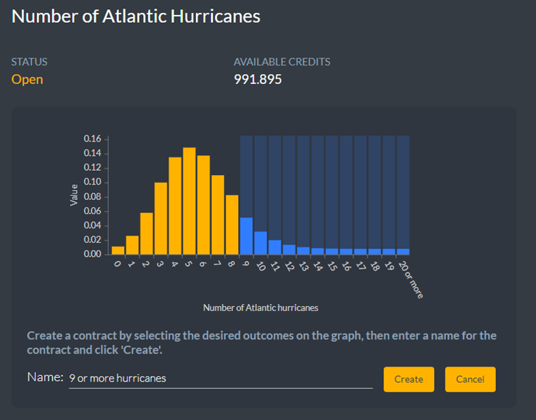

The CAHM24 prediction market is intended to produce a forecast of how many hurricanes will occur during the 2024 Atlantic hurricane season that represents the collective wisdom and expertise of all those taking part. 

The market will be hosted on the AGORA prediction market platform. The market will open for trading in December 2023 and it will remain open all the way through the season that begins on June 1 and will close on November 30 (although there might be periodic closures for maintenance). The market will be settled using the number of hurricanes that have occur in the Atlantic between June 1 and November 30, according to the U.S. National Hurricane Centre.

Once you have logged into AGORA select the market tab on the left-hand side and select the Atlantic hurricane market.

The market has 21 outcomes corresponding to no hurricanes, one hurricane, two hurricanes, and so on up to an outcome that covers 20 or more hurricanes. Each outcome has a current price which is set by the automated market maker based on its relative popularity. In December 2024, when the total number of hurricanes is known, the correct outcome will be worth 1.00 credit while all other outcomes will be worth nothing. After the market has been settled you will be eligible to receive £1 for every credit you’ve accumulated above your initial balance. If your final balance is less than your initial balance, you will receive nothing. The prices can interpreted as implied probabilities. If you believe an outcome is more probable than its current price you might consider buying it.

To make trading markets with many outcomes more manageable AGORA allows you to create contracts which cover one or more outcomes. Click on **Create a new contract** to do this.

You can click on the outcomes you want to include in the contract. If you only include a small number of outcomes AGORA will provide a default name listing the outcomes. A contract can’t be created without a name. The contracts you create are private, other participants cannot see them. Once you have created a contract it appears in your inventory, and you can buy some units of the contract from the market maker.

You can place an order by changing the **Quantity** column or the **Order** column. The market maker will quote a price which may differ from the listed price. The difference will be larger for big orders. If the quoted price is acceptable you can click on the **Action** to accept.

Contracts can cover multiple outcomes. You can click on individual outcomes to add them to a contract, or you can click and hold to include ranges of outcomes. 

To sell an outcome just enter a negative number in the **Order** column or reduce the number in the **Quantity** column. You cannot “short” a contract, that is you cannot sell a contract that you have not previously bought. Shorting is a strategy used in finance to take advantage of overpricing. However, because on AGORA the outcomes are defined to be mutually exclusive and comprehensively exhaustive (i.e., one and only one outcome must occur) and the prices of outcomes always sum to 1.00 then if you believe any outcome is overpriced then there must be other outcomes that are underpriced.

AGORA allows you to execute multiple orders simultaneously. If you enter more than one order (buys or sells) the market maker will give you a quote for the entire “basket”. 

 
